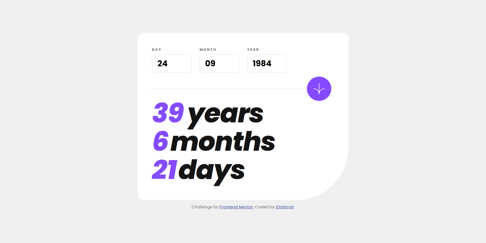

# Frontend Mentor - Age calculator app solution

## Table of contents

- [Overview](#overview)
  - [The challenge](#the-challenge)
  - [Screenshot](#screenshot)
  - [Links](#links)
- [My process](#my-process)
  - [Built with](#built-with)
- [Author](#author)

## Overview

### The challenge

Users should be able to:

- View an age in years, months, and days after submitting a valid date through the form
- Receive validation errors if:
  - Any field is empty when the form is submitted
  - The day number is not between 1-31
  - The month number is not between 1-12
  - The year is in the future
  - The date is invalid e.g. 31/04/1991 (there are 30 days in April)
- View the optimal layout for the interface depending on their device's screen size
- See hover and focus states for all interactive elements on the page
- **Bonus**: See the age numbers animate to their final number when the form is submitted

### Screenshot

### Links

- Solution URL: [Solution Page](https://www.frontendmentor.io/solutions/age-calculator-app-vb-wFu95OB)
- Live Site URL: [Deployment](https://iqadmat-age-calculator-app.netlify.app/)

## My process

### Built with

- JavaScript
- Bootstrap
- SASS
- Semantic HTML5 markup
- CSS custom properties
- Flexbox
- CSS Grid
- Multiple layouts

## Author

- Linkedin - [Mudasir Ali](https://www.linkedin.com/in/iqadmat/)
- Frontend Mentor - [@iQadmat](https://www.frontendmentor.io/profile/iQadmat)
